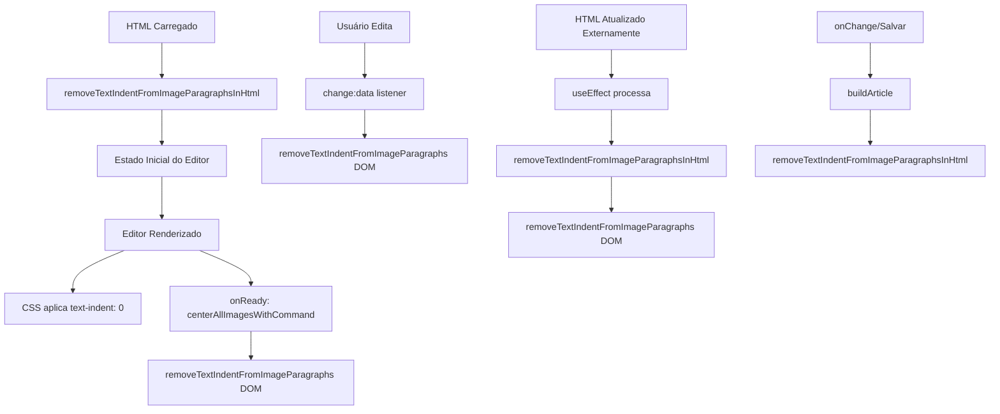

# Remoção Automática de text-indent de Parágrafos com Imagens

## Problema Identificado

Quando o HTML contém parágrafos `<p>` com imagens que possuem `text-indent` no estilo, isso causa um **recuo indesejado** nas imagens, desalinhando-as e prejudicando a apresentação visual.

### Exemplo do Problema

```html
<p style="font-family:'Century Gothic', sans-serif;font-size:11pt;line-height:1.5;text-align:justify;text-indent:141.75pt;">
  <span class="image-inline">
    
  </span>
</p>
```

O `text-indent:141.75pt;` faz com que a imagem apareça com um recuo de 141.75 pontos à esquerda, desalinhando a centralização.

## Solução Implementada

Implementamos uma solução **multi-camada** que remove automaticamente o `text-indent` de todos os parágrafos que contêm imagens.

### 1. CSS (Primeira Linha de Defesa)

```css
/* Remove text-indent de parágrafos que contêm imagens */
.otj-ckeditor .ck-content p:has(img),
.otj-ckeditor .ck-content p:has(.image-inline),
.otj-ckeditor .ck-content p:has(figure.image) {
  text-indent: 0 !important;
}
```

**Vantagem:** Funciona imediatamente via CSS, sem precisar de JavaScript.

**Limitação:** Alguns navegadores mais antigos podem não suportar `:has()`.

### 2. Processamento de HTML Inicial

Antes de carregar o conteúdo no editor, o HTML é processado para remover `text-indent`:

```typescript
function removeTextIndentFromImageParagraphsInHtml(html: string): string {
  const parser = new DOMParser();
  const doc = parser.parseFromString(html, 'text/html');
  
  const paragraphs = doc.querySelectorAll('p');
  
  paragraphs.forEach(p => {
    const hasImage = p.querySelector('img, .image-inline, figure.image, span.image-inline');
    
    if (hasImage) {
      const currentStyle = p.getAttribute('style') || '';
      
      if (currentStyle.includes('text-indent')) {
        // Remove text-indent mantendo outros estilos
        const newStyle = currentStyle
          .split(';')
          .map(s => s.trim())
          .filter(s => s && !s.toLowerCase().startsWith('text-indent'))
          .join('; ');
        
        if (newStyle) {
          p.setAttribute('style', newStyle);
        } else {
          p.removeAttribute('style');
        }
      }
    }
  });
  
  return doc.body.innerHTML;
}
```

**Onde é aplicado:**
- ✅ No estado inicial do editor (`useState`)
- ✅ Quando HTML é atualizado externamente (`useEffect`)
- ✅ Ao construir o article para salvar (`buildArticle`)

### 3. Processamento no DOM Durante Uso

Uma função JavaScript monitora e remove `text-indent` diretamente do DOM:

```typescript
const removeTextIndentFromImageParagraphs = () => {
  const editableElement = editor.editing.view.domRoots.get('main') as HTMLElement;
  if (!editableElement) return;

  const paragraphs = editableElement.querySelectorAll('p');
  let removedCount = 0;

  paragraphs.forEach((p) => {
    const hasImage = p.querySelector('img, .image-inline, figure.image');
    
    if (hasImage) {
      const pElement = p as HTMLElement;
      const currentStyle = pElement.getAttribute('style') || '';
      
      // Remove text-indent do atributo style
      if (currentStyle.includes('text-indent')) {
        const newStyle = currentStyle
          .split(';')
          .map(s => s.trim())
          .filter(s => s && !s.toLowerCase().startsWith('text-indent'))
          .join('; ');
        
        if (newStyle) {
          pElement.setAttribute('style', newStyle);
        } else {
          pElement.removeAttribute('style');
        }
        
        removedCount++;
      }
      
      // Remove também via JavaScript (CSSStyleDeclaration)
      if (pElement.style.textIndent) {
        pElement.style.removeProperty('text-indent');
        removedCount++;
      }
    }
  });

  if (removedCount > 0) {
    console.log(`✅ Removido text-indent de ${removedCount} parágrafos com imagens`);
  }
};
```

**Quando é executado:**
- ✅ Após centralizar imagens (onReady)
- ✅ Quando conteúdo muda (`change:data`)
- ✅ Após atualização externa do HTML
- ✅ No fallback de centralização de imagens

## Fluxo Completo



## Seletores Utilizados

A solução detecta imagens usando vários seletores para máxima compatibilidade:

```javascript
// Busca qualquer um destes elementos dentro do parágrafo
const hasImage = p.querySelector('img, .image-inline, figure.image, span.image-inline');
```

- `img` - Tag de imagem direta
- `.image-inline` - Classe do CKEditor para imagens inline
- `figure.image` - Elemento figure com classe image
- `span.image-inline` - Span wrapper com classe image-inline

## Preservação de Outros Estilos

A implementação **preserva todos os outros estilos** do parágrafo, removendo apenas o `text-indent`:

**Antes:**
```html
<p style="font-family:'Century Gothic';font-size:11pt;line-height:1.5;text-align:justify;text-indent:141.75pt;">
```

**Depois:**
```html
<p style="font-family:'Century Gothic';font-size:11pt;line-height:1.5;text-align:justify;">
```

## Logs de Debug

A implementação inclui logs para facilitar o debug:

```
✅ Removido text-indent de 3 parágrafos com imagens no HTML inicial
✅ Removido text-indent de 2 parágrafos com imagens
```

Verifique o console do navegador para confirmar que o processamento está funcionando.

## Casos de Uso Cobertos

| Caso | Solução |
|------|---------|
| HTML carregado com text-indent | ✅ Removido no processamento inicial |
| Usuário cola conteúdo com text-indent | ✅ Removido pelo listener change:data |
| Imagem inserida em parágrafo com text-indent | ✅ Removido automaticamente |
| HTML atualizado externamente | ✅ Removido no useEffect |
| Salvar documento | ✅ Removido no buildArticle |
| CSS aplicado inline | ✅ Sobrescrito por CSS :has() |

## Compatibilidade

- ✅ Chrome/Edge 105+
- ✅ Firefox 121+
- ✅ Safari 15.4+
- ⚠️ Navegadores antigos: CSS `:has()` pode não funcionar, mas JS funciona

## Testes Recomendados

1. **Carregar documento existente com text-indent em parágrafos de imagens**
   - Verificar se o text-indent foi removido
   - Confirmar logs no console

2. **Colar HTML com text-indent**
   - Copiar HTML com `<p style="text-indent:100pt"></p>`
   - Colar no editor
   - Verificar remoção automática

3. **Inserir imagem em parágrafo com text-indent existente**
   - Criar parágrafo com text-indent
   - Inserir imagem
   - Verificar se text-indent é removido

4. **Salvar e recarregar**
   - Salvar documento
   - Recarregar página
   - Confirmar que text-indent não reaparece

5. **Inspeção do DOM**
   - Inspecionar elementos `<p>` com imagens
   - Confirmar ausência de `text-indent` no style

## Arquivos Modificados

1. **`HtmlEditor.tsx`**:
   - Função `removeTextIndentFromImageParagraphsInHtml`
   - Função `removeTextIndentFromImageParagraphs`
   - Integração em vários pontos do ciclo de vida

2. **`ckeditor-shield.css`**:
   - Regras CSS com `:has()` para remover text-indent

## Considerações de Performance

- **HTML Processing**: O(n) onde n = número de parágrafos
- **DOM Processing**: O(n) onde n = número de parágrafos
- **Impacto**: Mínimo, executa apenas quando necessário
- **Otimização**: Usa seletores eficientes e processa apenas parágrafos com imagens

## Resolução de Problemas

### text-indent ainda aparece
1. Abra o console do navegador
2. Verifique se há logs de remoção
3. Inspecione o elemento `<p>` no DevTools
4. Confirme se o CSS está sendo aplicado

### Performance lenta
1. Verifique a quantidade de parágrafos no documento
2. Considere aumentar timeouts se necessário
3. Desabilite logs em produção se houver muitas imagens

### CSS :has() não funciona
- O fallback JavaScript continuará funcionando
- Apenas navegadores muito antigos serão afetados
- Considere polyfill se necessário
